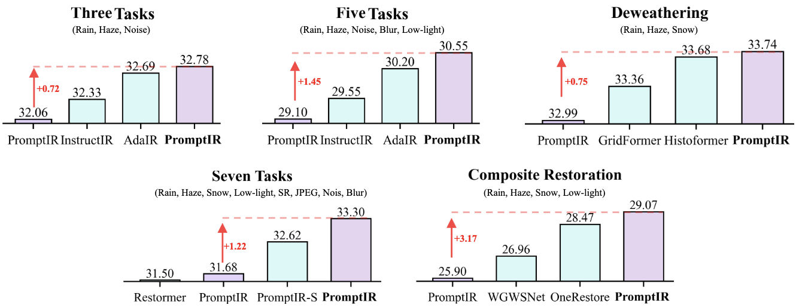
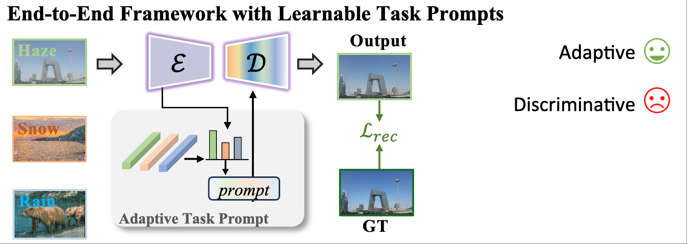
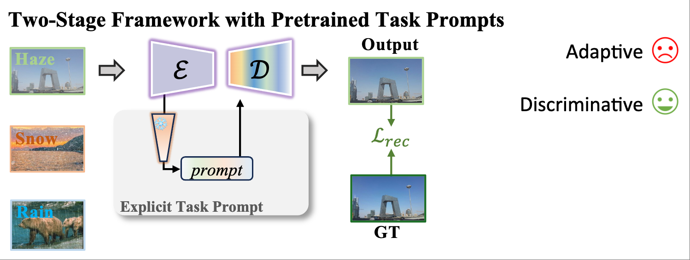

# Beyond Degradation Redundancy: Contrastive Prompt Learning for All-in-One Image Restoration

[Gang Wu](https://scholar.google.com/citations?user=JSqb7QIAAAAJ), [Junjun Jiang](http://homepage.hit.edu.cn/jiangjunjun)*, [Kui Jiang](https://homepage.hit.edu.cn/jiangkui), [Xianming Liu](http://homepage.hit.edu.cn/xmliu), and [Liqiang Nie](https://liqiangnie.github.io/)

## Overview

>All-in-one image restoration, addressing diverse degradation types with a unified model, presents significant challenges in designing task-specific prompts that effectively guide restoration across multiple degradation scenarios. While adaptive prompt learning enables end-to-end optimization, it often yields overlapping or redundant task representations. Conversely, explicit prompts derived from pretrained classifiers enhance discriminability but may discard critical visual information for reconstruction. To address these limitations, we introduce Contrastive Prompt Learning (CPL), a novel framework that fundamentally enhances prompt-task alignment through two complementary innovations: a  Sparse Prompt Module (SPM) that efficiently captures degradation-specific features while minimizing redundancy, and a  Contrastive Prompt Regularization (CPR) that explicitly strengthens task boundaries by incorporating negative prompt samples across different degradation types. Unlike previous approaches that focus primarily on degradation classification, CPL optimizes the critical interaction between prompts and the restoration model itself. Extensive experiments across five comprehensive benchmarks demonstrate that CPL consistently enhances state-of-the-art all-in-one restoration models, achieving significant improvements in both standard multi-task scenarios and challenging composite degradation settings. Our framework establishes new state-of-the-art performance while maintaining parameter efficiency, offering a principled solution for unified image restoration. 

 
  <table> 
    <tr> 
      <td align="center">
         End-to-End Framework</td>
    <td align="center">
       Prompt Learning Framework</td> 
    <td align="center">
       Contrastive Prompt Learning</td> 
    </tr> 
  </table> 

## Results
|Benchmark|Pretrained Model| Results|
|---|---|---|
|WeatherBench|[Model](https://drive.google.com/file/d/1XOwUCThKIKLov2FYWtyUA0AIB3rO7E_m/view?usp=sharing)|[Results](https://drive.google.com/file/d/1kCs5XlJJvhYQuNZFgOeQWXZiR2SU-yJS/view?usp=sharing)|

